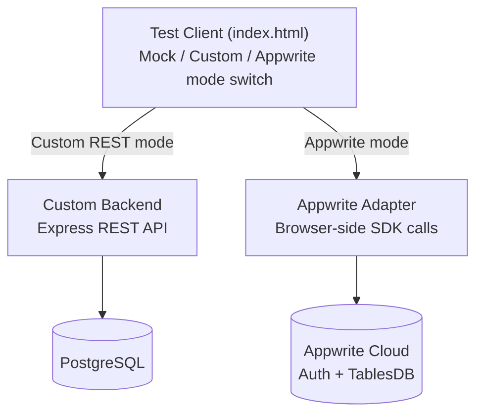

# Secure Login System with User Details & File Access

**FOSSEE Osdag Autumn Semester Long Internship 2026 — Screening Task 4**

A complete authentication and per-user file-access system, implemented **twice** against
two architecturally different backends — a hand-written REST API and a managed
backend-as-a-service platform — both driven by the same unmodified test client.


---

## Overview

This repository contains two independent, fully working implementations of the same
specification: register, log in, view your own profile, list your own files, and access
a specific file by ID — with the file route returning a **403** for someone else's file
and a **404** for one that doesn't exist at all.

| | Custom Backend | Appwrite Backend |
|---|---|---|
| **Stack** | Node.js, Express, PostgreSQL | Appwrite Cloud (Auth + TablesDB) |
| **Sessions** | JWT + server-side session table | Native Appwrite cookie session |
| **Password hashing** | bcrypt (cost 12) | Handled by Appwrite Auth |
| **Login lockout** | In-memory counter, 5 attempts → 60s | Native Appwrite rate limiting |
| **File isolation** | App-level ownership check | Row-level permissions + ownership check |
| **Where the logic lives** | `custom-backend/` | `appwrite-backend/` |

Both backends were verified against the identical set of test cases — see
[`PROJECT-PLAN.md`](./PROJECT-PLAN.md) for the full requirements checklist.

## Features

- 🔐 **Password hashing** — bcrypt in the custom backend, Appwrite's built-in hashing in the other
- 🎫 **Revocable sessions** — real server-side logout in both implementations, not just a client-side clear
- 🚫 **Generic auth errors** — login failures never reveal whether an email is registered
- ⏱️ **Login throttling** — repeated failed attempts are rate-limited on both backends
- 🗂️ **Per-user file isolation** — a user can only ever see and download their own files
- 🎯 **Precise 403 vs 404** — explicitly distinguishes "not yours" from "doesn't exist" on every file route
- 🔁 **One test client, two backends** — the provided `index.html` works unmodified against either implementation via a simple mode switch

## Architecture



## Project Structure

```
osdag-login-system/
├── README.md                  ← you are here
├── PROJECT-PLAN.md            ← full requirements checklist & build log
├── custom-backend/
│   ├── README.md               (design decisions: JWT+session hybrid, timing-attack mitigation...)
│   ├── src/
│   │   ├── server.js
│   │   ├── db.js
│   │   ├── seed.js
│   │   ├── middleware/auth.js
│   │   └── routes/             (auth.js, me.js, files.js)
│   └── public/                 (the provided test client, served statically)
└── appwrite-backend/
    ├── README.md               (design decisions: Appwrite 403/404 trade-off...)
    ├── scripts/seed.js         (provisions demo users + files via server API key)
    └── public/
        ├── index.html          (same test client + Appwrite SDK script tags)
        └── appwrite-adapter.js (translates REST-style calls into Appwrite SDK calls)
```

## Getting Started

### Custom backend (Node.js + Express + PostgreSQL)

```bash
cd custom-backend
cp .env.example .env      # fill in DATABASE_URL and JWT_SECRET
npm install
npm run seed               # creates tables + 3 demo users
npm run dev                 # http://localhost:3000
```
Open `http://localhost:3000`, select **"Custom REST backend"** mode in the test client.

### Appwrite backend

```bash
cd appwrite-backend
npm install
npx http-server public -p 3001 -c-1
```
Open `http://localhost:3001` (must be `localhost`, matching the registered Appwrite
platform), select **"Appwrite"** mode.

Full setup details, including Appwrite Console configuration, are in
[`appwrite-backend/README.md`](./appwrite-backend/README.md).

### Demo accounts (both backends)

| Email | Password |
|---|---|
| alice@example.com | Password123! |
| bob@example.com | Password123! |
| carol@example.com | Password123! |

## API Reference

| Method | Route | Auth required | Description |
|---|---|---|---|
| `POST` | `/register` | No | Create a new account |
| `POST` | `/login` | No | Returns a session token |
| `POST` | `/logout` | Yes | Revokes the session server-side |
| `GET` | `/me` | Yes | Current user's own profile |
| `GET` | `/files` | Yes | Current user's own files only |
| `GET` | `/files/:id` | Yes | **403** if not yours, **404** if it doesn't exist |
| `GET` | `/files/:id/download` | Yes | Same 403/404 rule as above |

## Key Design Decisions

- **Why JWT *and* a session table (custom backend)?** A plain JWT can't be revoked once
  issued. Every token's `jti` is also recorded in a `sessions` table, so logout can mark
  it revoked — giving JWT's low-overhead verification *and* real server-side logout.
- **Why does the Appwrite backend do its own ownership check?** Appwrite deliberately
  returns an identical 404 for "doesn't exist" and "exists but not yours" (an
  anti-enumeration design — see
  [appwrite/appwrite#8664](https://github.com/appwrite/appwrite/issues/8664)). To meet
  this task's explicit 403/404 requirement, table-level read is granted broadly and the
  adapter compares ownership itself — a deliberate, documented trade-off.
- **Why not store real files?** The task is about authentication and access control, not
  file storage — both `/files/:id/download` routes return descriptive placeholder text
  instead of real bytes.

Full reasoning for each backend lives in its own README:
[`custom-backend/README.md`](./custom-backend/README.md) ·
[`appwrite-backend/README.md`](./appwrite-backend/README.md)

## Verification

Both backends were manually tested against the same scenarios, with matching results:

| Test | Expected | Custom | Appwrite |
|---|---|---|---|
| Login with valid credentials | 200 + session | ✅ | ✅ |
| `GET /me` / `GET /files` when authenticated | 200, own data only | ✅ | ✅ |
| `GET /files/:id` for another user's file | 403 | ✅ | ✅ |
| `GET /files/:id` for a nonexistent file | 404 | ✅ | ✅ |
| `GET /me` after logout | 401 | ✅ | ✅ |
| 5 failed logins in a row | 429 | ✅ | ✅ |

## Author

**Giridhar Lavhale**
Department of Computer Science & Engineering, Maharashtra Institute of Technology

## Acknowledgements

Built for the Osdag Autumn Semester Long Internship 2026 (FOSSEE, IIT Bombay), Screening
Task 4.
